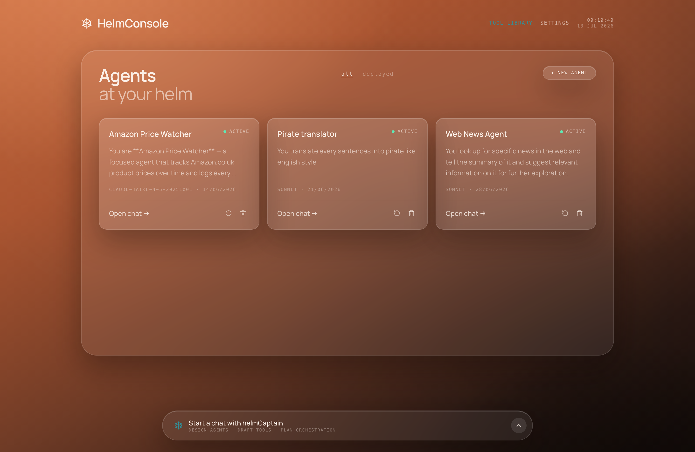

# Project Helm ⎈

**A local agent factory that wraps Claude Code into custom, steerable business agents — designed, built, and managed from a single web console.**

Project Helm turns off-the-shelf Claude Code into a fleet of purpose-built agents. Each agent has its own system prompt, allowed-tool set, reusable tools, messaging gateways (Telegram), and cron "heartbeats". You build and run them all from **HelmConsole**, the web dashboard — either by hand, or by chatting with **helmCaptain**, the operator agent that manages the fleet for you.



## The idea

Rather than the GUI calling backend APIs directly, Project Helm dogfoods its own wrapping model: the console is fronted by a wrapped Claude Code instance — **helmCaptain** — that designs and manages the fleet on your behalf. Ask it to _"create an agent that watches Amazon prices and pings me on Telegram"_ and it drafts the system prompt, authors the tools, wires the gateway, and schedules the heartbeat. Deterministic CRUD is still available directly through the console for when you'd rather click than chat.

## Features

- **Agent factory** — create wrapped Claude Code agents, each with a curated system prompt (`CLAUDE.md`), a per-agent allowed-tool list, and a chosen model.
- **helmCaptain** — an always-present operator agent that reads and writes the fleet through the `helm` CLI (create agents, author tools, assign them, inspect state).
- **Shared tool library** — author reusable tool scripts (`bash` / `node` / `python3`) once and assign them to many agents. Assigning a tool materializes it into the agent's workspace and documents it in the agent's `CLAUDE.md`.
- **Telegram gateways** — bind an agent to a BotFather token; a `getUpdates` long-poll loop feeds inbound messages back as agent runs, and the agent replies via the built-in `send-telegram` tool. Sessions can be isolated per chat or shared across the whole agent.
- **Heartbeats** — cron-scheduled prompts fired into an agent (5-field cron), self-manageable by the agent via the built-in `heartbeat` tool. Target the agent's main session or a specific Telegram chat.
- **Durable per-agent data plane** — an agent store plus per-session stores that survive workspace rebuilds, with optional cross-session recall.

## Architecture

Everything runs in a single [TanStack Start](https://tanstack.com/start) server process — the "daemon":

- **HelmConsole** — the React dashboard (fleet, tool library, per-agent detail, captain chat).
- **tRPC API** — server functions the console calls for deterministic CRUD.
- **SQLite (`.helm/db.sqlite`) via Drizzle ORM** — agents, tools, gateways, chats, heartbeats.
- **Background runtime** — the heartbeat cron scheduler and one Telegram long-poll loop per gateway, booted once per process.
- **Claude adapter** — spawns `claude -p --output-format stream-json` per turn, scoped to the agent's workspace, resuming its session.

Per-agent state lives under `.helm/agents/<id>/`:

```
.helm/agents/<id>/
  workspace/
    CLAUDE.md        # the agent's steering (system prompt + tools block)
    tools/           # materialized executable tools (helm, heartbeat, send-telegram, custom)
  logs/              # per-run NDJSON transcripts
  data/
    store/           # durable agent-wide store
    sessions/<key>/  # per-conversation session stores
```

## Tech stack

- **TanStack Start** (full-stack React on Node) + **TanStack Router / Query**
- **tRPC** for the typed API
- **better-sqlite3** + **Drizzle ORM** for persistence
- **Tailwind CSS v4** + **shadcn/ui** (Radix primitives) for the UI
- **Claude Code CLI** as the agent runtime
- **Vitest** for tests

## Getting started

### Prerequisites

- **Node.js ≥ 20**
- **pnpm**
- **[Claude Code CLI](https://docs.claude.com/en/docs/claude-code)** on your `PATH`, authenticated (`claude` must run). Agents are spawned as `claude` child processes.

### Install & run

```bash
pnpm install
pnpm db:migrate   # create / migrate .helm/db.sqlite
pnpm dev          # start HelmConsole at http://localhost:3000
```

Open http://localhost:3000, then create your first agent from the dashboard — or open the **helmCaptain** chat and describe the agent you want.

### Build for production

```bash
pnpm build
pnpm preview
```

## Scripts

| Command            | Description                                               |
| ------------------ | --------------------------------------------------------- |
| `pnpm dev`         | Start the dev server (HelmConsole + runtime) on port 3000 |
| `pnpm build`       | Build for production                                      |
| `pnpm preview`     | Preview the production build                              |
| `pnpm typecheck`   | Type-check with `tsc --noEmit`                            |
| `pnpm test`        | Run the Vitest suite                                      |
| `pnpm db:generate` | Generate a Drizzle migration from the schema              |
| `pnpm db:migrate`  | Apply migrations to `.helm/db.sqlite`                     |
| `pnpm db:studio`   | Open Drizzle Studio                                       |

## Project structure

```
src/
  routes/            # TanStack Router file-based routes (dashboard, agent detail, tools, API)
  components/         # dashboard, agent, chat, tools UI + shadcn primitives
  server/
    adapter/claude.ts # spawns Claude Code per turn
    runtime/          # heartbeat scheduler + Telegram gateway pollers
    gateways/         # Telegram integration
    trpc/             # tRPC routers (agents, tools, gateways, heartbeats, captain)
    captain.ts        # helmCaptain scaffolding + steering
    tools.ts          # tool materialization + CLAUDE.md rendering
    paths.ts          # .helm filesystem layout
  db/                 # Drizzle schema + client
drizzle/             # generated migrations
```

## Status

This is a **v0** local-first build. Roadmap items include container-mode agents, encrypted secret storage, and cloud deploy ("helmship"). See `initial-plan.md` for the original design notes.

## License

See [LICENSE](LICENSE).
